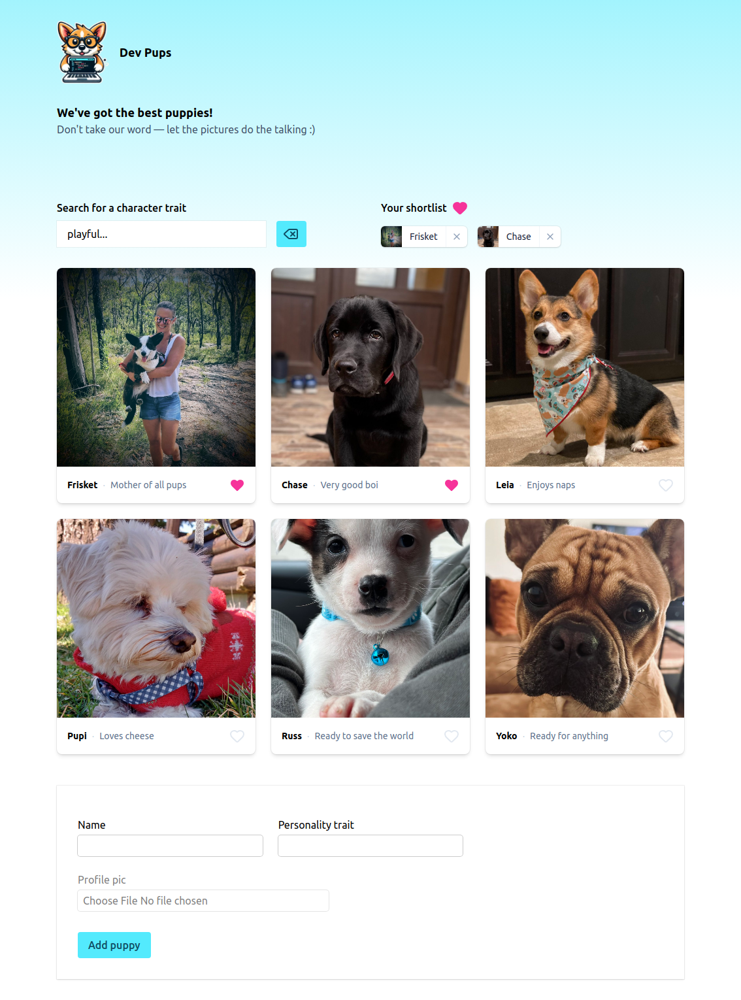

# dev-pups - Fullstack App (React + Vite + Node/Express + Bun)

This is a fullstack monorepo application with a React frontend and a Node/Express backend.

Both services are started together using a single root development command.

---

## Structure

packages/
client - React + Vite frontend
server - Node.js + Express backend

---

## Getting Started

### Install dependencies

```bash
bun install
```

### Start the fullstack app (recommended)

```bash
bun run dev
```

This starts both services:

Frontend → http://localhost:5173  
Backend → http://localhost:3000

Internally, the root script runs both processes in parallel using concurrently:

server: packages/server  
client: packages/client

## Screenshot of the page


